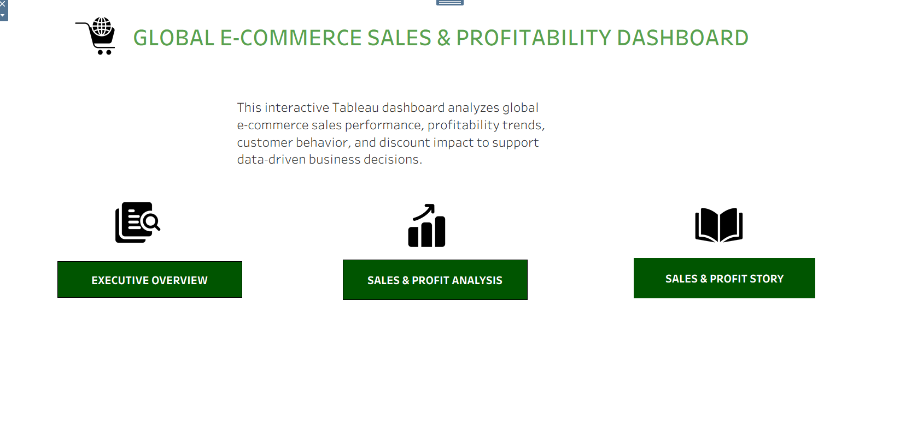
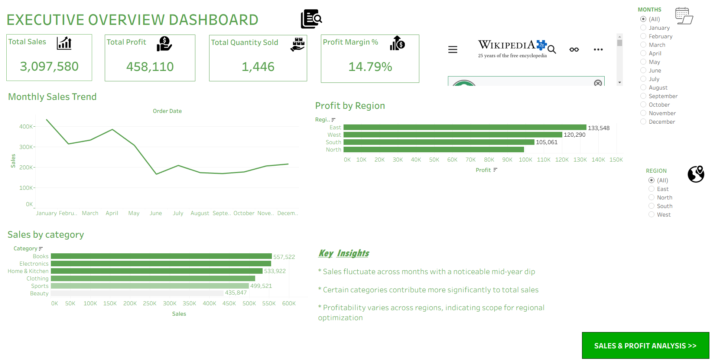
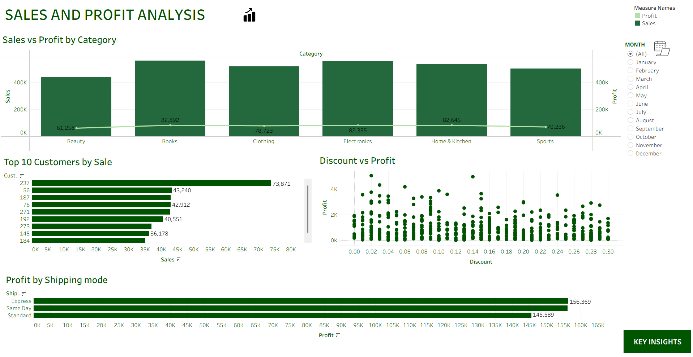
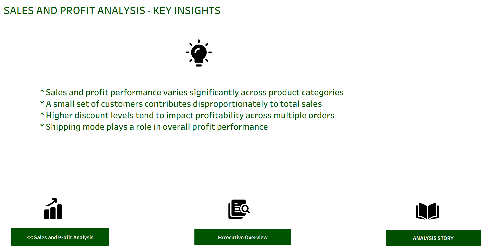
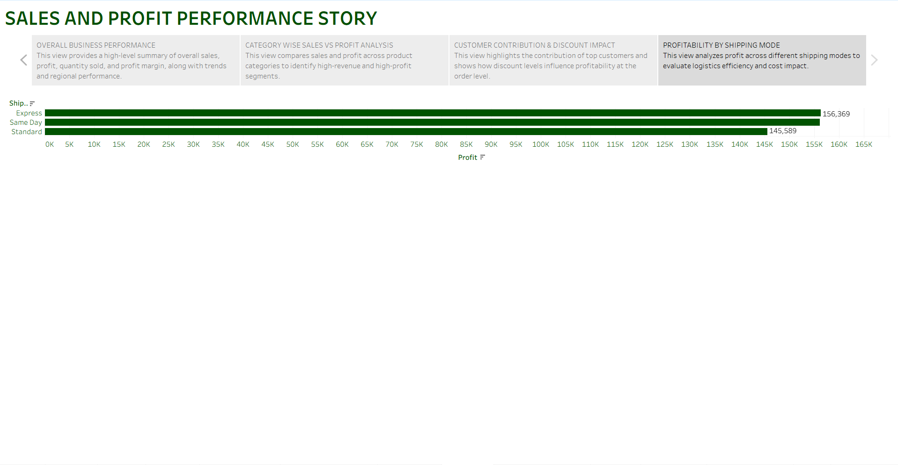

Files Included:
- Tableau Workbook (.twb)
- E-commerce Sales Dataset
- Home Dashboard
- Executive Overview Dashboard
- Sales & Profit Analysis Dashboard
- Key Insights Dashboard
- Story Dashboard

Tools Used:
Tableau, Data Visualization, Dashboard Design, Business Intelligence

Features:
Interactive dashboards, KPI tracking, profitability analysis, customer insights, and executive reporting.
[11:00 pm, 03/06/2026] Sree: # Global E-Commerce Sales & Profitability Dashboard

## Project Overview

This Tableau project analyzes global e-commerce sales performance, profitability trends, customer behavior, and discount impact. The dashboard helps stakeholders make data-driven business decisions through interactive visualizations and KPI tracking.

## Key Metrics

- Total Sales
- Total Profit
- Total Quantity Sold
- Profit Margin (%)

## Dashboard Pages

### Home Page
Project navigation and dashboard overview.

### Executive Overview
High-level KPIs and business performance summary.

### Sales & Profit Analysis
Analysis of category performance, customer contribution, shipping mode profitability, and discount impact.

### Key Insights
Business findings and actionable recommendations.

### Story Dashboard
End-to-end business story explaining sales and profitability trends.

## Tools & Technologies

- Tableau Public
- Data Visualization
- Business Intelligence
- Dashboard Design
- Data Analysis

## Repository Contents

- Tableau Workbook (.twb)
- E-commerce Dataset (.csv)
- Home Page Screenshot
- Executive Overview Screenshot
- Sales & Profit Analysis Screenshot
- Key Insights Screenshot
- Story Dashboard Screenshot

## Author

*Sreejith K R*

GitHub: github.com/sreejithkr123

## Dashboard Screenshots

### Home Page

### Executive Overview

### Sales & Profit Analysis

### Key Insights

### Story Dashboard

LinkedIn: linkedin.com/in/sreejithkr12
